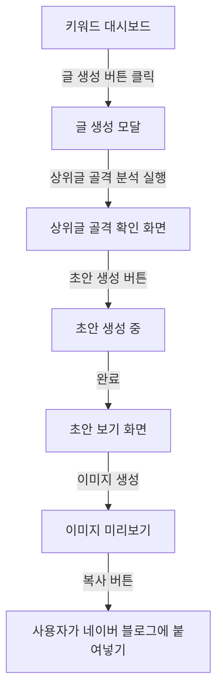

# 네이버 블로그 콘텐츠 자동화 사용자 플로우

> 작성일: 2026-08-04 · 버전: v1

## 1. 메인 플로우

## 2. 화면별 플로우

### 화면 1: 키워드 대시보드 (기존)
- 진입: 대시보드 첫 화면
- 행동: 키워드 행에서 "글 생성" 버튼 클릭
- 이탈: 글 생성 모달 (screen-03 진입 전 단계)

### 화면 2: 초안 보기
- 진입: 상위글 골격 확인 후 "초안 생성" 클릭, 생성 완료 대기
- 행동: 초안 텍스트(제목·첫문단·본문) 확인, "이미지 생성" 클릭, 이미지 미리보기 확인, "복사" 클릭
- 이탈: 복사 후 네이버 블로그 편집기로 이동 (외부)

### 화면 3: 상위글 골격 확인 (모달)
- 진입: 글 생성 버튼 클릭 시
- 행동: 해당 키워드 상위글들의 구조(질문형 소제목·비교·수치) 미리보기, "초안 생성" 클릭
- 이탈: 초안 보기 화면으로

## 3. 예외 플로우

- **초안 생성 실패(API 오류) 시**: 오류 메시지 표시 + "다시 시도" 버튼. 이전 골격 분석 결과는 유지
- **이미지 생성 실패(키 미발급 401) 시**: "이미지 키가 필요합니다" 안내. 텍스트 초안은 계속 사용 가능 (이미지만 선택 사항)
- **네트워크 에러 시**: "연결이 불안정합니다" + 재시도 버튼
- **스냅샷 없는 키워드에서 생성 시도 시**: "아직 데이터가 쌓이는 중" 안내, 생성 차단

## Loop Metadata

- Upstream documents referenced: 01-prd.md (Must 기능 3개), 02-trd.md (아키텍처)
- Downstream documents affected: 06-screens.md, 06-tasks.md
- Open questions: 없음
- Assumptions: 반자동 (초안 → 수동 발행), 이미지는 선택 사항
- Validation criteria: 대시보드→글 생성→초안 반환 플로우가 4단계로 완결
- Risks: 이미지 생성 실패 시에도 텍스트 흐름은 정상 동작해야 함
