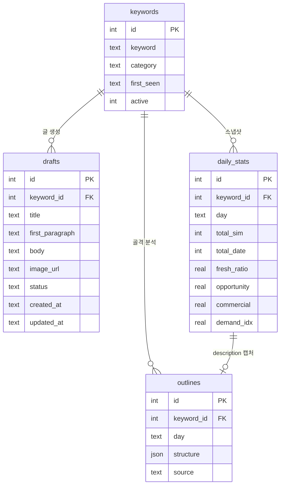

# 네이버 블로그 콘텐츠 자동화 데이터베이스 설계

> 작성일: 2026-08-04 · 버전: v1
> 기존 스키마(seed_keywords, keywords, daily_stats, top_results, collection_log, collection_runs)는 그대로 유지하고, 콘텐츠 자동화용 테이블 2개를 추가한다.

## 1. ERD

## 2. 테이블 정의

### 테이블 1: drafts (글 초안)

| 컬럼 | 타입 | 제약 | 설명 |
|------|------|------|------|
| id | SERIAL/INTEGER | PK | 기본키 |
| keyword_id | INTEGER | FK → keywords.id | 어떤 키워드로 만든 초안인지 |
| title | TEXT | NOT NULL | 생성된 제목 |
| first_paragraph | TEXT | NOT NULL | 첫문단 (즉답 구조) |
| body | TEXT | NOT NULL | 본문 (질문형 소제목 포함) |
| image_url | TEXT | DEFAULT '' | 생성된 블로그 이미지 URL (미생성 시 빈 값) |
| status | TEXT | NOT NULL DEFAULT 'draft' | draft(초안) / published(발행됨) — 현재는 draft만 사용 |
| created_at | TEXT | NOT NULL | 생성 시각 (KST ISO) |
| updated_at | TEXT | NOT NULL DEFAULT '' | 수정 시각 (KST ISO) |

### 테이블 2: outlines (상위글 골격)

| 컬럼 | 타입 | 제약 | 설명 |
|------|------|------|------|
| id | SERIAL/INTEGER | PK | 기본키 |
| keyword_id | INTEGER | FK → keywords.id | 분석 대상 키워드 |
| day | TEXT | NOT NULL | 분석일 (KST) |
| structure | JSONB/TEXT | NOT NULL | 추출된 골격 (질문형 소제목·비교·수치 목록) |
| source | TEXT | NOT NULL DEFAULT 'naver_blog_search' | 데이터 출처 (블로그 검색 API) |

### 기존 테이블 변경 (daily_stats — description 캡처)

- 현재 analyzer.py가 블로그 검색 API 응답의 `description` 필드를 버리고 있어, 상위글 골격 분석을 위해 캡처 필요
- **변경안**: analyzer.py에서 blog_sim 상위 20개 항목의 `description`을 수집, `outlines.structure`에 저장 (daily_stats에 컬럼 추가 대신 outline 테이블로 분리 — 정규화 유지)

## 3. 인덱스

- `drafts.keyword_id` (키워드별 초안 조회)
- `outlines.keyword_id + day` (중복 분석 방지용 유니크, 재분석은 day 갱신)
- 기존 인덱스 그대로 유지

## 4. 제약 조건

- Foreign Key: drafts.keyword_id → keywords.id, outlines.keyword_id → keywords.id
- Unique: outlines(keyword_id, day) — 같은 날 같은 키워드 중복 분석 방지
- status: 'draft' | 'published' (현재 버전은 draft만 사용, published는 다음 버전 예약)

## Loop Metadata

- Upstream documents referenced: 01-prd.md (초안 생성), 02-trd.md (Supabase Postgres)
- Downstream documents affected: 07-coding-convention.md, 06-tasks.md
- Open questions: 없음
- Assumptions: description 캡처는 outline 테이블로 분리 (daily_stats 변경 최소화)
- Validation criteria: drafts·outlines 테이블 생성 SQL이 SQLite/Postgres 양쪽에서 실행됨
- Risks: analyzer.py의 description 캡처 확장이 기존 84개 테스트를 깨지 않아야 함
