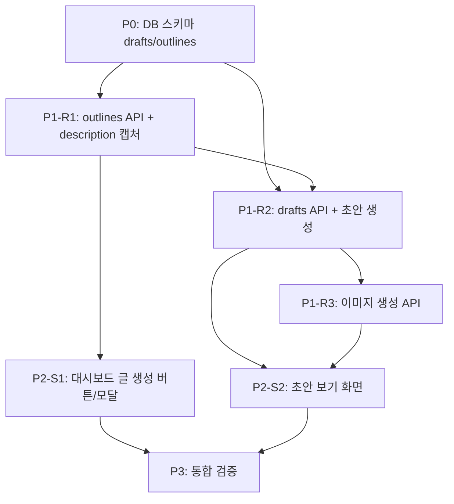

# 네이버 블로그 콘텐츠 자동화 — 태스크 목록 (v1)

> 작성일: 2026-08-04 · 입력: `specs/screens/*.yaml`, `specs/domain/resources.yaml`, `docs/planning/01~10`
> 실행: /auto-orchestrate (단일 워커 의존성 자동 빌드)
> 프로젝트 구조: FastAPI(server.py) + 단일 HTML(static/index.html) + Supabase Postgres + GitHub Actions

## 의존성 그래프

## Phase 0: 프로젝트 셋업

### [ ] P0-T1: drafts/outlines 테이블 스키마 추가
- **담당**: database-specialist
- **파일**: `tests/test_db_postgres.py` → `db.py`
- **스펙**: SCHEMAS(sqlite/postgres)에 `drafts`(id, keyword_id FK, title, first_paragraph, body, image_url, status, created_at, updated_at), `outlines`(id, keyword_id FK, day, structure, source) 테이블 추가. outlines(keyword_id, day) 유니크. 기존 84개 테스트 유지
- **Worktree**: `worktree/phase-0`
- **TDD**: RED → GREEN → REFACTOR
- **병렬**: 없음 (기반 작업)

## Phase 1: Backend Resource

### [ ] P1-R1-T1: outlines Resource — description 캡처 + 골격 추출
- **담당**: backend-specialist
- **리소스**: outlines
- **엔드포인트**:
  - GET /outlines/{keyword_id} (최신 골격 조회, 없으면 404)
  - POST /outlines/{keyword_id} (골격 분석 실행 — 인증 필요)
- **필드**: id, keyword_id, keyword, day, structure, source
- **파일**: `tests/test_analyzer.py`, `tests/test_outline.py` → `analyzer.py`, `outline.py` (신규)
- **스펙**: analyzer.py가 블로그 검색 API `description` 필드를 캡처(현재 버림) → outline.py가 질문형 소제목·비교·수치 구조를 추출해 outlines.structure(JSON)로 저장. db.py에 outlines CRUD 메서드 추가
- **Worktree**: `worktree/phase-1-resources`
- **TDD**: RED → GREEN → REFACTOR
- **헌법**: 기존 `db.py`/`analyzer.py` 패턴 준수 (KST 헬퍼, 오류 정규화)
- **병렬**: P1-R2와 병렬 가능 (Mock 사용)

### [ ] P1-R2-T1: drafts Resource — 초안 생성 API
- **담당**: backend-specialist
- **리소스**: drafts
- **엔드포인트**:
  - POST /drafts (키워드로 초안 생성 — 인증 필요)
  - GET /drafts/{id} (초안 단건 조회)
- **필드**: id, keyword_id, keyword, title, first_paragraph, body, image_url, status, created_at, updated_at
- **파일**: `tests/test_draft_generator.py` → `draft_generator.py` (신규), `server.py`
- **스펙**: outline 구조를 프롬프트에 넣고 `opencode run -m opencode-go/deepseek-v4-flash` 1회 실행 → 제목·첫문단(즉답)·본문(질문형 소제목) 반환 → drafts 저장. CLI 미설치 시 명확한 오류 반환. db.py에 drafts CRUD 메서드 추가
- **Worktree**: `worktree/phase-1-resources`
- **TDD**: RED → GREEN → REFACTOR (opencode CLI는 Mock 처리)
- **병렬**: P1-R1 완료 후

### [ ] P1-R3-T1: 이미지 생성 API
- **담당**: backend-specialist
- **리소스**: drafts (image_url 갱신)
- **엔드포인트**:
  - POST /drafts/{id}/image (이미지 생성 — 인증 필요)
- **필드**: image_url
- **파일**: `tests/test_image_gen.py` → `image_gen.py` (신규), `server.py`
- **스펙**: `bl image generate` (qwen 계열) 호출 → 생성 이미지 URL을 drafts.image_url에 저장. API 키 미설정/401 시 "이미지 키가 필요합니다" 오류 반환(텍스트 초안은 유지). 키는 환경 변수에서만 로드
- **Worktree**: `worktree/phase-1-resources`
- **TDD**: RED → GREEN → REFACTOR (bl CLI는 Mock 처리)
- **병렬**: P1-R2 완료 후

## Phase 2: Frontend Screen

### [ ] P2-S1-T1: 대시보드 글 생성 버튼 + 골격 모달
- **담당**: frontend-specialist
- **화면**: `/` (기존 대시보드)
- **컴포넌트**: generate_button, outline_structure, modal_header
- **데이터 요구**: keywords, outlines
- **파일**: `static/index.html` (수정), `static/app.js` (신규 분리 또는 기존 인라인 유지)
- **스펙**: 키워드 행에 "글 생성" 버튼 추가 → 클릭 시 POST /outlines/{keyword_id} 호출 → 골격 구조(질문형 소제목·비교·수치 태그) 모달 표시 → "초안 생성" 버튼으로 POST /drafts 연결. 스냅샷 없는 키워드는 버튼 비활성 + "데이터 쌓는 중" 안내
- **Worktree**: `worktree/phase-2-dashboard`
- **TDD**: RED → GREEN → REFACTOR
- **데모 상태**: loading(골격 생성 중), error(오류 재시도), empty(스냅샷 없음)
- **병렬**: P1-R1 완료 후 (Mock 사용 가능)

### [ ] P2-S2-T1: 초안 보기 화면
- **담당**: frontend-specialist
- **화면**: `/drafts/:id` (모달)
- **컴포넌트**: draft_title, draft_first_paragraph, draft_body, image_preview, copy_button
- **데이터 요구**: drafts
- **파일**: `static/index.html` (수정), `static/app.js`
- **스펙**: 골격 모달에서 POST /drafts 응답을 받아 초안 보기 모달 표시 — 제목(H1)·첫문단·본문(질문형 소제목) 섹션, "이미지 생성" 버튼(POST /drafts/{id}/image, 스피너 표시), "복사" 버튼(클립보드 + "복사됨!" 피드백). 이미지 키 미발급 시 안내(텍스트 유지)
- **Worktree**: `worktree/phase-2-dashboard`
- **TDD**: RED → GREEN → REFACTOR
- **데모 상태**: loading(생성 중), error(오류), normal(완료)
- **병렬**: P1-R2, P1-R3 완료 후

## Phase 3: Verification

### [ ] P3-V1: 연결점 검증 + e2e
- **담당**: test-specialist
- **검증 항목**:
  - [ ] Field Coverage: drafts/outlines 필드가 resources.yaml과 정합
  - [ ] Endpoint: POST /drafts, GET /drafts/{id}, POST /drafts/{id}/image, GET·POST /outlines/{keyword_id} 존재
  - [ ] Navigation: 대시보드 → 골격 모달 → 초안 모달 → 복사 플로우
  - [ ] Auth: 쓰기 엔드포인트 전부 require_token 적용
  - [ ] 기존 84개 테스트 + 신규 테스트 전체 통과
  - [ ] 실제 opencode CLI로 초안 생성 스모크 (로컬 검증: "1+1"→"2")
- **파일**: `tests/test_api.py` 확장, `tests/e2e_dashboard.py` 확장
- **Worktree**: `worktree/phase-3-verify`
- **완료 기준**: pytest 전체 통과 + 대시보드에서 수동 스모크 가능

## 태스크 요약

| 구분 | 태스크 수 |
|------|-----------|
| Phase 0 | 1개 |
| Backend Resource | 3개 |
| Frontend Screen | 2개 |
| Verification | 1개 |
| **총계** | **7개** |

## Loop Metadata

- Upstream documents referenced: 01-prd.md ~ 10-desire-map.md, specs/screens/*.yaml, specs/domain/resources.yaml
- Downstream documents affected: /auto-orchestrate 실행
- Open questions: 이미지 생성용 qwen API 키 재발급 (사용자 작업, P1-R3는 Mock으로 진행 가능)
- Assumptions: opencode CLI는 GitHub Actions 러너에서 실행 가능 (Vercel 함수 60초 제한은 후순위 검증)
- Validation criteria: pytest 전체 통과, 대시보드→글 생성→초안 반환 플로우 동작
- Risks: opencode CLI의 서버리스 호환성 — GitHub Actions 배치로 우회 가능
